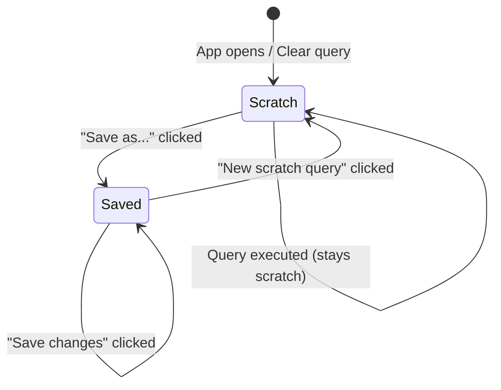

# Implementation Plan: Scratch Pad / Anonymous Requests

## Overview

Enable users to write and execute throwaway queries without saving them to the persistent saved queries collection. This addresses the need for quick experimentation and one-off debugging without cluttering the saved queries tree.

---

## Architecture Decision

### Approach: **Implicit Scratch Mode (Hybrid)**

After analyzing the codebase and feature requirements, the recommended approach is an **implicit scratch mode** where:

1. The editor starts in "scratch" mode by default (no saved query loaded)
2. Users can optionally save scratch queries at any time
3. Executed scratch queries appear in history (already implemented)
4. Scratch mode is visually indicated but not intrusive

**Why this approach over alternatives:**

| Approach | Pros | Cons |
|----------|------|------|
| **Explicit "Scratch" tab** | Clear separation | Requires tab system (Feature #1), UI complexity |
| **Auto-save to "Drafts" folder** | Recoverable | Clutters saved queries, defeats purpose |
| **Implicit scratch mode** ✓ | Minimal UI change, natural workflow, history provides recovery | Less explicit separation |

The implicit approach aligns with the current single-editor model and existing history system. When multi-tab support (Feature #1) is added, scratch tabs can be a natural extension.

---

## Data Model Changes

### No new persistence required

The current system already supports this workflow:
- `QueryPageState._currentSavedQueryId$` = `null` indicates scratch mode
- `QueryHistory` already captures all executed queries
- `lastQueryByDb` restores the last query per database on reconnect

### Optional enhancement: Session scratch queries

For future consideration, we could persist scratch queries within the session:

```typescript
// In concept/saved-query.ts (OPTIONAL - Gate 3)
interface SessionScratchData {
    currentQueryText: string;
    lastModified: string;
}
```

This would allow recovery after accidental page refresh, stored in `sessionStorage` (not `localStorage`).

---

## UI/UX Design

### Current State Indicator

The header currently shows:
```
Query — [Saved Query Name]*
```

For scratch mode, display:
```
Query — Scratch
```

### Visual Differentiation

| State | Header Text | Save Button | Dirty Indicator |
|-------|-------------|-------------|-----------------|
| Scratch (clean) | "Query — Scratch" | "Save as..." only | None |
| Scratch (modified) | "Query — Scratch" | "Save as..." only | None (always "dirty") |
| Saved (clean) | "Query — [Name]" | Both buttons | None |
| Saved (dirty) | "Query — [Name]*" | Both buttons | `*` |

### Transition Flows



### New UI Elements

1. **"New scratch query" button** in sidebar header (next to "New query")
2. **"Scratch" indicator** in query header when no saved query is loaded
3. **"Clear editor" context menu option** (returns to scratch with empty editor)

---

## Gates (Implementation Phases)

### Gate 1: Visual Scratch Mode Indicator

**Goal:** Users can see when they're in scratch mode vs editing a saved query.

**Tasks:**
1. Update `query-page.component.html` to show "Scratch" when `currentSavedQueryId$` is null and editor has content
2. Add "Scratch" styling in `query-page.component.scss` (subtle visual distinction)
3. Hide the "Save changes" button in scratch mode (already correct behavior)

**Files Modified:**
- `src/module/query/query-page.component.html`
- `src/module/query/query-page.component.scss`

**Verification:**
- [ ] Open app with empty editor → Header shows "Query"
- [ ] Type in editor without saving → Header shows "Query — Scratch"
- [ ] Load a saved query → Header shows "Query — [Name]"
- [ ] Modify saved query → Header shows "Query — [Name]*"
- [ ] "Save changes" button only appears for saved queries with changes

---

### Gate 2: New Scratch Query Action

**Goal:** Users can explicitly start a new scratch query, clearing the current editor.

**Tasks:**
1. Add `clearToScratch()` method to `QueryPageState` service
2. Add "New scratch" button to saved queries window header
3. Add keyboard shortcut `Cmd+N` / `Ctrl+N` for new scratch query
4. Show confirmation dialog if current query is dirty (unsaved changes)

**Files Modified:**
- `src/service/query-page-state.service.ts`
- `src/module/query/saved-queries-window/saved-queries-window.component.html`
- `src/module/query/saved-queries-window/saved-queries-window.component.ts`
- `src/module/query/query-page.component.ts` (keymap)

**New Method in QueryPageState:**
```typescript
clearToScratch(): void {
    this._currentSavedQueryId$.next(null);
    this._originalQueryText$.next("");
    this.queryEditorControl.patchValue("");
}
```

**Verification:**
- [ ] Click "New scratch" button → Editor clears, header shows "Query"
- [ ] Press Cmd+N with dirty saved query → Confirmation dialog appears
- [ ] Press Cmd+N with clean state → Editor clears immediately
- [ ] After clearing, typing shows "Query — Scratch"

---

### Gate 3: Session Persistence (Optional)

**Goal:** Scratch query content survives page refresh within the same session.

**Tasks:**
1. Add `SessionScratchService` using `sessionStorage`
2. Auto-save scratch content on change (debounced)
3. Restore scratch content on page load if no saved query was loaded
4. Clear session scratch when explicitly starting new scratch or loading saved query

**Files Created:**
- `src/service/session-scratch.service.ts`

**Files Modified:**
- `src/service/query-page-state.service.ts`

**Verification:**
- [ ] Type in scratch mode → Refresh page → Content restored
- [ ] Load saved query → Refresh page → Saved query loads (not scratch)
- [ ] Click "New scratch" → Refresh page → Editor empty (scratch cleared)
- [ ] Execute query in scratch → Content still there after refresh

---

### Gate 4: History Integration Enhancement (Optional)

**Goal:** Make it easy to promote history entries to saved queries.

**Tasks:**
1. Add "Save to collection" context menu option on history entries
2. Add "Load into editor" context menu option on history entries
3. Visual indicator for queries that are already saved vs scratch-originated

**Files Modified:**
- `src/module/query/query-page.component.html`
- `src/module/query/query-page.component.ts`

**Verification:**
- [ ] Right-click history entry → "Save to collection" opens save dialog
- [ ] Right-click history entry → "Load into editor" loads query as scratch
- [ ] Saved query runs show link icon in history
- [ ] Scratch query runs show no icon in history

---

## Interaction with Existing Systems

### History Integration
- **Current behavior (unchanged):** All executed queries are added to `QueryHistory`
- **Enhancement:** History entries could track whether they originated from a saved query or scratch

### Tab System (Future Feature #1)
When multi-tab support is added:
- Scratch queries would be "untitled" tabs
- Multiple scratch tabs allowed
- Tab close prompts to save if dirty
- This plan's implementation provides the foundation

### Keyboard Shortcuts
| Shortcut | Action |
|----------|--------|
| `Cmd+N` / `Ctrl+N` | New scratch query |
| `Cmd+S` / `Ctrl+S` | Save (opens dialog if scratch, saves if named) |
| `Cmd+Enter` | Run query (existing) |

---

## Migration & Backwards Compatibility

No migration needed. The feature is additive:
- Existing saved queries unchanged
- Existing history unchanged
- Default behavior (starting with empty editor) is already "scratch mode"

---

## Testing Checklist

### Manual Testing
- [ ] New user experience: Open app → Type query → Run → Works without saving
- [ ] Power user flow: Edit saved query → Decide to discard → New scratch clears
- [ ] Accidental close: Type long query → Close tab → Reopen → Content recovered (Gate 3)
- [ ] History workflow: Run scratch query → Find in history → Save from history (Gate 4)

### Edge Cases
- [ ] Empty editor should NOT show "Scratch" indicator
- [ ] Loading saved query then clearing text should stay in saved query mode (dirty)
- [ ] Session storage limit: Very large queries should gracefully degrade

---

## Estimated Effort

| Gate | Complexity | Effort |
|------|------------|--------|
| Gate 1: Visual Indicator | Low | 1-2 hours |
| Gate 2: New Scratch Action | Medium | 2-3 hours |
| Gate 3: Session Persistence | Medium | 3-4 hours |
| Gate 4: History Enhancement | Low | 2-3 hours |

**Recommended MVP:** Gates 1 + 2 (4-5 hours)
**Full Feature:** All gates (8-12 hours)

---

## Open Questions

1. **Should scratch content auto-save to session storage?** Recommended: Yes (Gate 3), provides safety net without cluttering saved queries.

2. **Should we add a "Scratch Pad" folder in the sidebar?** Not recommended. Defeats the purpose of throwaway queries and adds clutter.

3. **How does AI chat mode interact with scratch?** The chat history is already separate. Scratch mode only affects the code editor tab.

4. **Should scratch queries have their own history section?** Not recommended for MVP. The unified history is sufficient.
